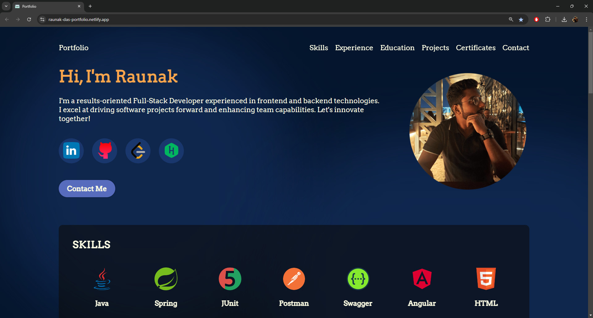

# personal-portfolio-website

**Description** : Web Application to showcase Personal Portfolio

**Tech Stack** : ReactJS, HTML, CSS, Bootstrap, Material-UI

**Live Website** : https://raunak-das-portfolio.netlify.app/

**How to Run (Windows)** :

1. Import Frontend files to an IDE like VSCode
2. Goto path "portfolio/" in VSCode Terminal
3. Run commands [**npm install**] to install necessary Node Modules
4. Run Frontend by running the command [**npm run dev**]
5. Go to http://localhost:5173 on your Browser to access the Application

**Sample Screenshots** :

